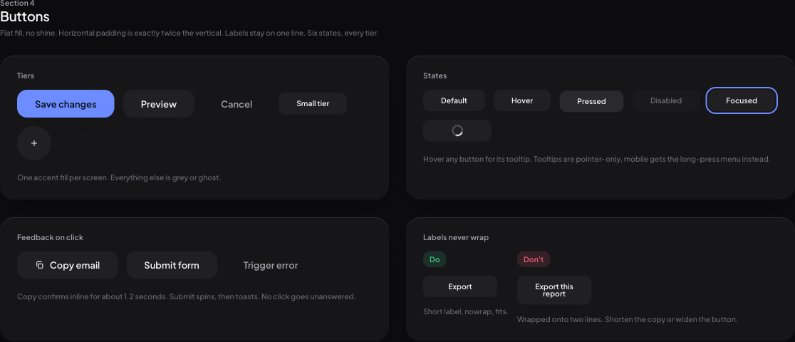
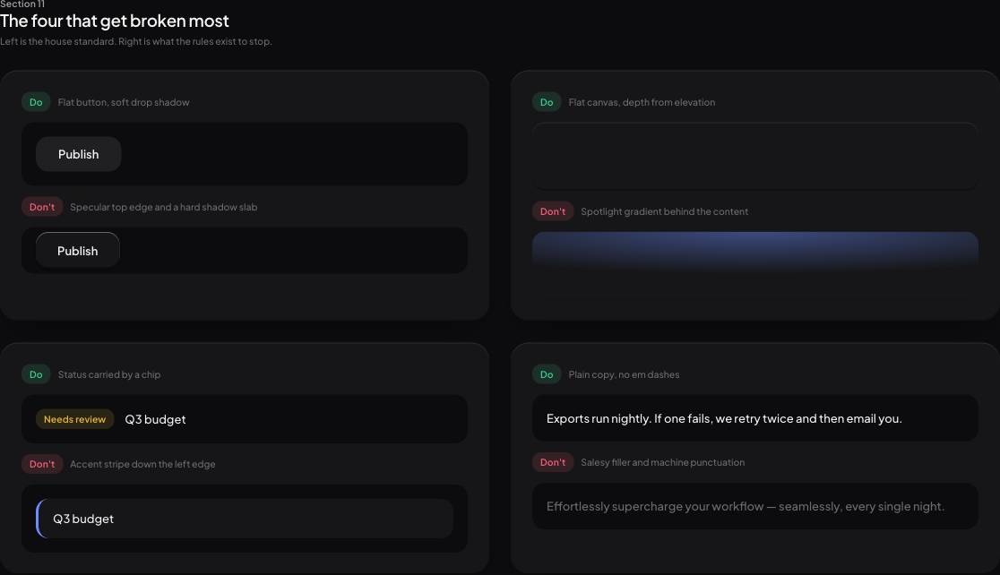
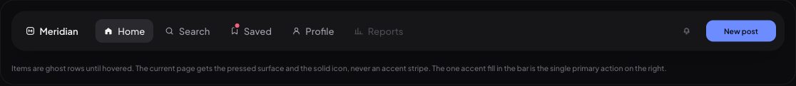
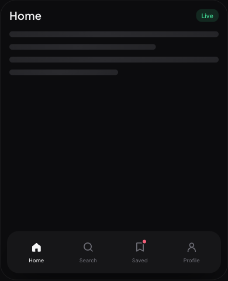
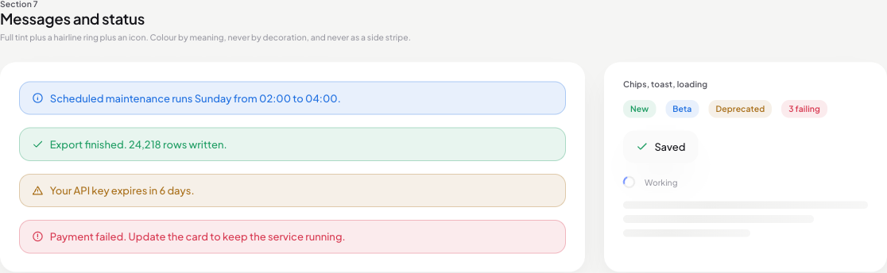

# anti-vibecode

Strict house design standards for frontend and UI work. A Claude Code skill that makes generated
interfaces stop looking AI-generated.

It enforces one accent colour over a neutral grey, black, and white system. No background spotlight
gradients, no side accent stripes, no shine. Buttons are mostly grey and flat, with dimmed strokes,
2:1 padding, and labels that never wrap. Shadows are soft and diffuse, spacing breathes, the grid is
12 columns on desktop and 2 to 4 on mobile, type is 13px on desktop and 17px on mobile with leading
and tracking that tighten as the type grows. Every interaction gets a visible response, and colour
only ever appears when it carries meaning.



Flat fills, one accent for the single primary action, six states per tier, and a label that never
runs onto a second line.



Each rule ships with the thing it exists to stop, so the difference is visible rather than described.




One set of nav items, two shapes. The icon is outline at rest and solid when the item is pressed or
current, so the nav says where you are without a second colour.



Semantic colour carries meaning and nothing else. Blue is information, green is success, amber is a
warning, red is danger. Everything holds up in both themes.

## Contents

- `SKILL.md` — the rules and how to apply them
- `references/anti-vibecode.css` — the full token sheet plus component classes (drop-in)
- `references/patterns.md` — drop-in implementations for the behaviours referenced in the skill
- `references/demo.html` — the whole system rendered, in dark and light, desktop and phone
- `hooks/antivibecode-ui-reminder.sh` — optional hook that keeps the rules in force on every UI edit

## Use as a Claude Code skill

Clone into your skills directory:

```bash
git clone https://github.com/C-lb/anti-vibecode.git ~/.claude/skills/anti-vibecode
```

It then activates automatically on frontend and UI work, or on request ("make this anti-vibecode").

To update later: `git -C ~/.claude/skills/anti-vibecode pull`.

## Optional: keep the rules in force on every edit

A skill can drift out of context on a long session. The included hook watches `Write` and `Edit`,
detects when the file being touched is UI (by extension, or by markup inside a `.js`/`.ts` file), and
injects the standards back into context. It never blocks a tool call, it only adds context. It needs
`jq` on your PATH.

Add this to the `hooks` block of `~/.claude/settings.json`:

```json
"PreToolUse": [
  {
    "matcher": "Write|Edit",
    "hooks": [
      {
        "type": "command",
        "command": "bash \"$HOME/.claude/skills/anti-vibecode/hooks/antivibecode-ui-reminder.sh\"",
        "timeout": 5
      }
    ]
  }
]
```

If you already have a `PreToolUse` array, add the matcher object to it rather than replacing it.
Restart Claude Code, then edit any `.css` or `.tsx` file to confirm the reminder fires.

## Use without Claude Code

Nothing here is Claude-specific.

- Drop `references/anti-vibecode.css` into any project and build from its tokens and classes. It is
  plain CSS with no build step and no dependencies.
- Open `references/demo.html` in a browser to see the target look. It links the real token sheet, so
  it can never drift from the rules.
- `SKILL.md` reads as an ordinary style guide, and works pasted into any other agent's rules file
  (Cursor rules, `AGENTS.md`, a system prompt).
